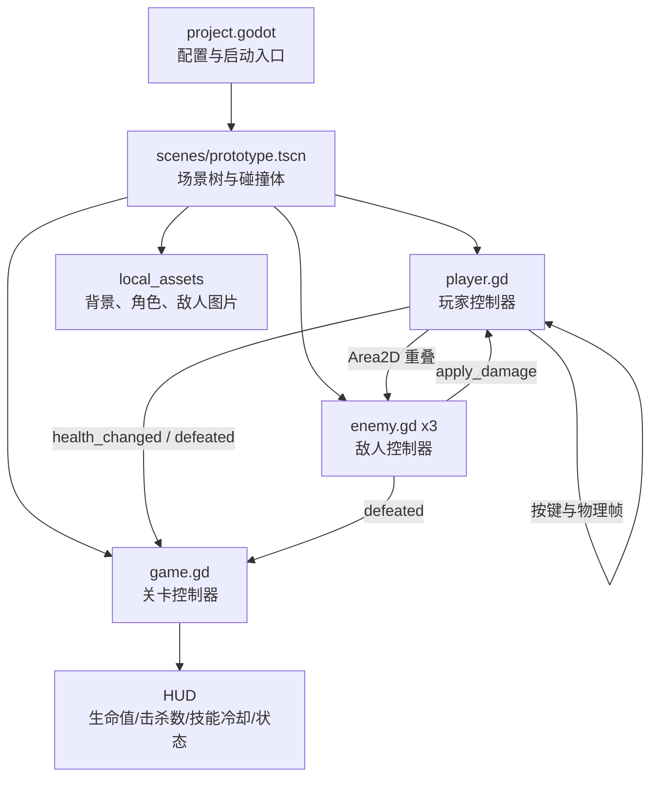

# Zmxy Online Prototype 架构说明

> 面向第一次接触项目的开发者。本文基于当前仓库代码整理，重点说明已经存在的运行链路；未接入的能力会明确标注。

## 本次讲解覆盖范围

我会优先讲：

1. Godot 项目如何启动并加载主场景
2. 场景节点与脚本的职责边界
3. 玩家输入、移动、攻击和技能的执行链路
4. 敌人追踪、攻击、受伤和死亡链路
5. 信号如何驱动关卡计数和 HUD
6. 当前配置、测试/部署入口与已识别的支线

这次先不展开但已识别的支线：`local_assets/` 中的大量素材和音频目前只是资源库；`scripts/health.gd` 是可复用生命值组件，但当前场景没有挂载它；仓库暂无自动化测试、CI 或导出发布脚本。

## 1. 项目定位

这是一个 Godot 4 横版动作 RPG 原型，用来验证以下最小闭环：

`玩家输入 -> 角色移动/战斗 -> 敌人受伤或玩家受伤 -> 信号通知关卡控制器 -> HUD 更新`

当前项目是单场景、单线程、纯本地运行的原型，不包含网络同步、持久化存档、数据驱动技能配置或正式状态机。

## 2. 全局架构图



## 3. 目录与职责

```text
zmxy/
├── project.godot                 # Godot 工程配置；指定主场景、窗口和渲染器
├── scenes/
│   └── prototype.tscn             # 当前唯一可运行场景：背景、玩家、地面、3 个敌人、HUD
├── scripts/
│   ├── game.gd                    # 场景级编排：连接信号、刷新 HUD、重开和胜负状态
│   ├── player.gd                  # 玩家移动、跳跃、输入边沿检测、攻击和技能
│   ├── enemy.gd                   # 敌人追踪、近距离攻击、受伤、击败信号
│   └── health.gd                  # 通用 Health 类；目前未挂载到 prototype 场景
├── local_assets/                  # 本机素材包（README 说明已被 Git 忽略）
├── Assets/                        # 预留/外部工程资源目录，目前无主链路脚本
├── Packages/                      # 工程预留目录
└── README.md                      # 开发环境、当前状态和下一步
```

## 4. 启动与场景装配

### 4.1 启动入口

`project.godot` 中的真实配置是：

```ini
[application]
config/name="Zmxy Online Prototype"
run/main_scene="res://scenes/prototype.tscn"

[display]
window/size/viewport_width=1280
window/size/viewport_height=720

[rendering]
renderer/rendering_method="gl_compatibility"
```

启动时 Godot 直接实例化 `prototype.tscn`。场景根节点 `Prototype` 挂载 `game.gd`，因此 `_ready()` 是运行时编排的第一处业务代码。

### 4.2 场景树

```text
Prototype (Node2D, game.gd)
├── Background (Sprite2D)
├── Player (CharacterBody2D, group: player, player.gd)
│   ├── CollisionShape2D       # 64 x 110 的角色碰撞体
│   ├── Sprite                  # 角色贴图
│   ├── AttackFlash             # 攻击视觉效果，默认隐藏
│   ├── SkillFlash              # 技能视觉效果，默认隐藏
│   └── AttackArea (Area2D)     # 90 x 90 的近战检测区域
├── Ground (StaticBody2D)       # 1280 x 80 的地面
├── Enemies (Node2D)
│   ├── Enemy1 (CharacterBody2D, group: enemy, enemy.gd)
│   ├── Enemy2 (CharacterBody2D, group: enemy, enemy.gd)
│   └── Enemy3 (CharacterBody2D, group: enemy, enemy.gd)
└── HUD (CanvasLayer)
    ├── Title / Instructions
    ├── Counter                    # 击败敌人计数
    ├── Skill                      # 技能冷却
    ├── Health (ProgressBar)       # 玩家生命值
    └── Status                     # 胜负/通关文案
```

## 5. 核心链路 A：场景初始化与信号装配

代码片段 A（`scripts/game.gd`）：

```gdscript
func _ready() -> void:
    # 找到场景中所有 enemy 组成员，为每个敌人的死亡事件注册同一个回调
    for enemy in get_tree().get_nodes_in_group("enemy"):
        enemy.defeated.connect(_on_enemy_defeated)
    # 玩家生命变化和死亡也交给关卡控制器处理
    player.health_changed.connect(_on_player_health_changed)
    player.defeated.connect(_on_player_defeated)
    _update_counter()
```

这一层收到的结构是场景树和节点组集合：`enemy[] = [Enemy1, Enemy2, Enemy3]`，`player = $Player`。它不直接计算伤害，而是建立事件路由。敌人发出的 `defeated` 会进入 `_on_enemy_defeated()`；玩家发出的 `health_changed(current, maximum)` 会进入 `_on_player_health_changed()`。

## 6. 核心链路 B：玩家输入、移动与动作

代码片段 B（`scripts/player.gd`）：

```gdscript
func _physics_process(delta: float) -> void:
    attack_timer = maxf(0.0, attack_timer - delta)
    skill_timer = maxf(0.0, skill_timer - delta)
    if not is_on_floor():
        velocity.y += gravity * delta

    # A/左方向为 -1，D/右方向为 +1
    var direction := float(Input.is_key_pressed(KEY_D) or Input.is_key_pressed(KEY_RIGHT)) \
        - float(Input.is_key_pressed(KEY_A) or Input.is_key_pressed(KEY_LEFT))
    if direction != 0:
        facing = 1 if direction > 0 else -1
        $Sprite.scale.x = facing
    velocity.x = move_toward(velocity.x, direction * move_speed, move_speed * 8.0 * delta)

    # “当前按下”配合 *_was_down，只在按键刚按下的一帧触发
    if Input.is_key_pressed(KEY_K) and is_on_floor() and not _jump_was_down:
        velocity.y = jump_velocity
    _jump_was_down = Input.is_key_pressed(KEY_K)
    if (Input.is_key_pressed(KEY_J) or Input.is_key_pressed(KEY_X)) and not _attack_was_down:
        attack()
    if Input.is_key_pressed(KEY_L) and not _skill_was_down:
        cast_skill()
    _attack_was_down = Input.is_key_pressed(KEY_J) or Input.is_key_pressed(KEY_X)
    _skill_was_down = Input.is_key_pressed(KEY_L)
    move_and_slide()
```

执行结果与参数流向：

1. 输入层产生 `direction: -1/0/1`，传给 `velocity.x`；`move_speed` 默认 `320.0`。
2. 空中时用 `gravity * delta` 累加 `velocity.y`；落地由 Godot 碰撞系统通过 `is_on_floor()` 判断。
3. `K/J/X/L` 的按下边沿分别调用跳跃、攻击、技能；计时器阻止攻击和技能在冷却期间重复执行。
4. `move_and_slide()` 消费整个 `velocity`，并更新角色的实际位置。

## 7. 核心链路 C：攻击与技能如何造成伤害

代码片段 C（玩家攻击/技能）：

```gdscript
func attack() -> void:
    if attack_timer > 0.0:
        return
    attack_timer = attack_cooldown
    attack_area.position.x = 58.0 * facing
    for target in attack_area.get_overlapping_bodies():
        if target.has_method("apply_damage"):
            target.apply_damage(attack_damage, Vector2(facing, -0.2))
    _show_effect($AttackFlash, 0.12, 1.0)

func cast_skill() -> void:
    if skill_timer > 0.0:
        return
    skill_timer = skill_cooldown
    _show_effect($SkillFlash, 0.35, 2.0)
    for target in get_tree().get_nodes_in_group("enemy"):
        if is_instance_valid(target) \\
            and abs(target.global_position.x - global_position.x) < 260.0 \\
            and abs(target.global_position.y - global_position.y) < 140.0:
            target.apply_damage(60, Vector2(facing, -0.5))
```

攻击层收到的结构：`AttackArea` 当前位于玩家前方 `58 * facing`，碰撞结果是 `CharacterBody2D[]`。它传给敌人的结构是 `apply_damage(amount, direction)`，普通攻击为 `{amount: 25, direction: (±1, -0.2)}`。技能不依赖 Area2D，而是遍历 enemy 组，按横向小于 `260`、纵向小于 `140` 的矩形范围筛选，传入 `{amount: 60, direction: (facing, -0.5)}`。

`_show_effect()` 只负责把 `AttackFlash`/`SkillFlash` 显示一小段时间，并通过 Tween 将透明度恢复，不参与战斗判定。

## 8. 核心链路 D：敌人 AI、受伤与死亡

代码片段 D（`scripts/enemy.gd`）：

```gdscript
func _physics_process(delta: float) -> void:
    attack_timer = maxf(0.0, attack_timer - delta)
    if not is_instance_valid(player):
        return
    var distance := global_position.distance_to(player.global_position)
    if distance > attack_range:
        var direction := signf(player.global_position.x - global_position.x)
        velocity.x = move_toward(velocity.x, direction * move_speed, 700.0 * delta)
    else:
        velocity.x = move_toward(velocity.x, 0.0, 1000.0 * delta)
        if attack_timer == 0.0 and player.has_method("apply_damage"):
            attack_timer = 1.0
            player.apply_damage(attack_damage, Vector2(signf(player.global_position.x - global_position.x), -0.2))
    if not is_on_floor():
        velocity.y += 1500.0 * delta
    move_and_slide()

func apply_damage(amount: int, direction := Vector2.ZERO) -> void:
    current_health = maxi(0, current_health - amount)
    $HealthBar.value = current_health
    velocity += direction * 180.0
    if current_health == 0:
        defeated.emit()
        queue_free()
```

这一层收到玩家位置 `Vector2` 和伤害对象参数。距离大于 `attack_range = 75.0` 时追踪玩家；进入范围后停止水平移动，每秒最多攻击一次，调用玩家的 `apply_damage(10, knockback_direction)`。敌人受伤后将 `current_health` 写回自身 `HealthBar`，生命归零时先发出 `defeated`，再 `queue_free()` 从场景树移除。

## 9. 核心链路 E：信号、胜负和 HUD

代码片段 E（`scripts/game.gd`）：

```gdscript
func _on_enemy_defeated() -> void:
    defeated_count += 1
    _update_counter()
    if defeated_count >= 3:
        status.text = "关卡完成！按 R 重新挑战"

func _on_player_health_changed(current: int, maximum: int) -> void:
    $HUD/Health.value = current
    $HUD/Health.max_value = maximum

func _on_player_defeated() -> void:
    status.text = "你被击败了，按 R 重新开始"
```

事件输入结构：

| 事件 | 参数 | 控制器动作 | HUD 产物 |
|---|---|---|---|
| `Enemy.defeated` | 无 | `defeated_count += 1` | `击败敌人：n / 3` |
| `Player.health_changed` | `current, maximum` | 更新 ProgressBar 数值和上限 | 玩家血条 |
| `Player.defeated` | 无 | 写入失败状态 | `你被击败了...` |

`game.gd::_process()` 每帧读取 `player.skill_timer`，将技能状态渲染为“就绪”或带一位小数的冷却时间；按下 `R` 会调用 `reload_current_scene()`，通过重新实例化场景重置所有运行时状态。

## 10. 数据与依赖边界

### 当前真实运行时对象

```json
{
  "player": {
    "current_health": 100,
    "max_health": 100,
    "attack_damage": 25,
    "attack_cooldown": 0.35,
    "skill_cooldown": 3.0,
    "facing": 1
  },
  "enemy": {
    "count": 3,
    "current_health": 50,
    "move_speed": 100.0,
    "attack_damage": 10,
    "attack_range": 75.0
  }
}
```

上面对象是根据场景默认值和脚本导出变量还原的运行时结构，不是网络协议或存档格式。外部依赖只有 Godot 引擎的物理、场景树、输入和 Tween；没有数据库、HTTP 服务、消息队列或第三方 SDK。

## 11. 配置、测试与部署入口

- 运行：用 Godot 4.x 打开仓库，运行 `project.godot` 指定的主场景；也可在编辑器中直接运行 `scenes/prototype.tscn`。
- 输入：当前代码直接调用 `Input.is_key_pressed()`，没有在 `project.godot` 中配置 InputMap 动作名。
- 测试：暂无 `test/`、`tests/`、GUT 或 CI 配置；建议优先补攻击冷却、死亡信号、重开场景和三敌通关测试。
- 发布：暂无导出预设、Docker 或发布脚本；正式发布前需确认 `local_assets/` 的素材授权和导出平台资源导入。

## 12. 当前限制与演进建议

1. `health.gd` 与 `player.gd`/`enemy.gd` 各自维护生命值，存在重复实现；后续可让玩家和敌人组合 `Health` 节点，并统一伤害/死亡信号。
2. 敌人只有“追踪/攻击”二态，没有巡逻、受击硬直、攻击动画或寻路状态机。
3. 攻击判定在一次按键触发时立即读取重叠体，尚未区分攻击前摇、有效帧和无敌帧。
4. `queue_free()` 后 `game.gd` 的计数逻辑仍可靠，因为死亡信号在释放前发出；若未来加入异步死亡动画，需要明确计数时机。
5. 玩家死亡后只移除节点并更新文案；输入和 HUD 的生命周期管理仍适合原型，正式版本应引入明确的游戏状态（Playing/Won/Lost）。

## 13. 未展开但已识别的关键支线

- 素材管线：`local_assets/images`、`sounds` 和字体资源影响视觉与音频表现，但不改变当前脚本调用链。
- 通用生命组件：`scripts/health.gd` 已定义 `damaged`/`died` 信号，适合作为下一步重构切入点。
- 关卡扩展：当前所有敌人和碰撞体硬编码在一个 `.tscn`，新增关卡时应拆分可复用敌人场景和关卡配置。

## 下一步深挖建议

1. 把 `Health` 组件接入玩家和敌人，统一生命值边界与信号。
2. 将输入改为 InputMap 动作，支持手柄和可配置按键。
3. 为敌人增加状态机与攻击/受击动画，并把攻击判定放到动画有效帧。
4. 增加 Godot 单元/场景测试，覆盖伤害、冷却、胜负和重开流程。
